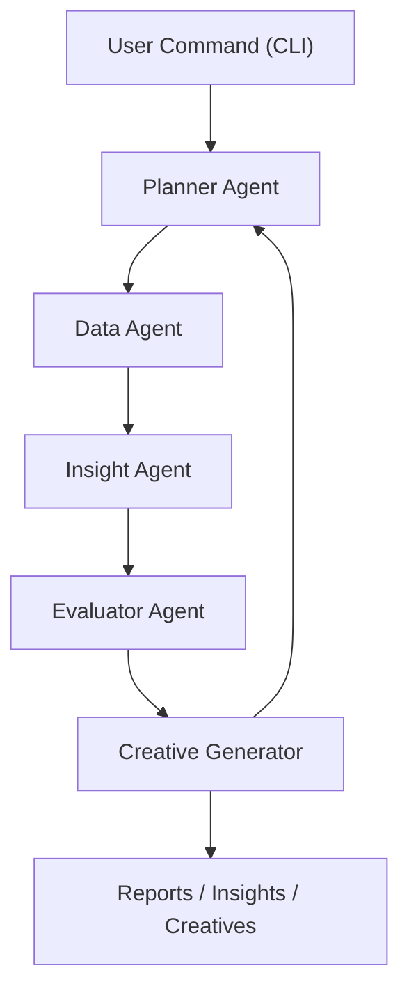
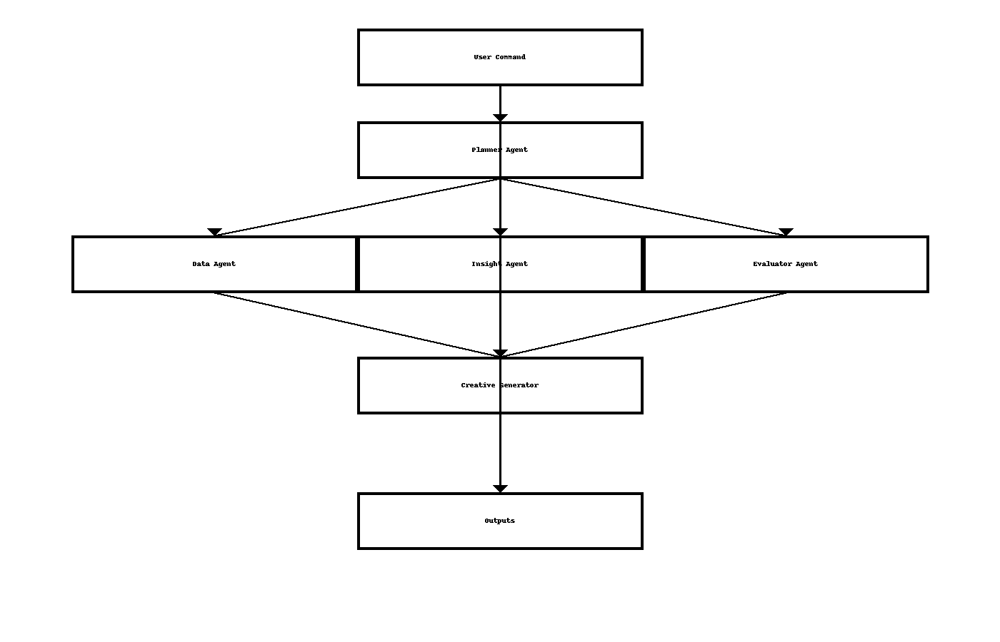

# Agent Graph — Kasparro Agentic FB Analyst

## System Architecture Diagram (Mermaid + PNG)

### Mermaid Diagram (renders on GitHub)

### PNG Diagram (visual version)

---

## Agent Roles and Data Flow

### **Planner Agent**
- Decomposes high-level instruction into structured tasks.
- Coordinates execution order (data → insights → validation → creatives).
- Handles reflection logic if confidence is low.

### **Data Agent**
- Loads CSV, cleans columns, constructs aggregates.
- Produces campaign-level and month-level summaries.

### **Insight Agent**
- Generates hypotheses based on observed performance patterns:
  - ROAS drop detection  
  - CTR decline  
  - Impression drop  
  - Creative fatigue signals  

### **Evaluator Agent**
- Validates hypotheses using quantitative checks:
  - ROAS deltas  
  - CTR change  
  - t-tests / statistical evidence  

### **Creative Generator**
- Generates new creative recommendations using:
  - Extracted keywords  
  - Benefit, urgency, and social-proof variants  
- Outputs structured creatives.json.

### **Output Artifacts**
- insights.json  
- creatives.json  
- report.md  

